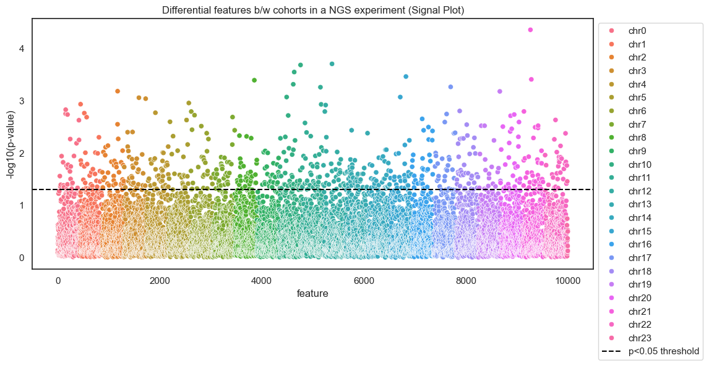

## Overview
The outlier sum statistic is a statistical method to identify differential features between 2 sets of data based on differences in the outliers in the 2 cohorts. Mostly, this sort of difference in outliers is observed in complex biological diseases (for example cancers) - where outlier individuals for genes potentially associated with the disease will be found. It was first introduced by tibshiranine in the paper \href{https://doi.org/10.1093/biostatistics/kxl005}

## Visualization of significant differential features between 2 cohorts:

*X-axis: Could be ordered set of genes on a chromosome*