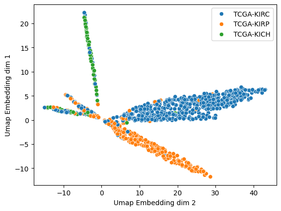

## Background:

In a previous study, we  heterogeneity exploration of bulk transcriptomic profiling was visually and quantitatively compared by applying PCA, MDS, t-SNE, and UMAP when parameters were set as default. In 71 sizable datasets of bulk transcriptomic profiling in two-dimensional space, UMAP was shown to be superior in preserving sample-level neighborhood information and maintaining clustering accuracy, thus conspicuously differentiating batch effects, identifying pre-defined biological groups, and identifying clustering structures associated with biological features and clinical meaning.

Paper: [Dimensionality reduction Application by UMAP in bulk transcriptomic data](https://www.sciencedirect.com/science/article/pii/S2211124721008597)

## Problem statement

Given ~1500 samples total for 3 sub-types of Kidney cancer and 60660 gene expression features (Normalized fragments per kilo million[fpkm]), how well can we stratify the sub-types and quantify genes associated with each cohort? 

## Recommended UMAP Pipeline

[Paper reference](https://www.sciencedirect.com/science/article/pii/S2211124721008597#sec4) Yang Yang, Hongjian Sun, Yu Zhang, Tiefu Zhang, Jialei Gong, Yunbo Wei, Yong-Gang Duan, Minglei Shu, Yuchen Yang, Di Wu, Di Yu,
Dimensionality reduction by UMAP reinforces sample heterogeneity analysis in bulk transcriptomic data,
Cell Reports,
Volume 36, Issue 4,
2021,
109442,
ISSN 2211-1247,
https://doi.org/10.1016/j.celrep.2021.109442.

### Questions:

##### Sub-type stratification:
- Which method provides best overall stratification of the sub-types visually?

- Which method shows better segregation of batch effects?
  
- What is the performance of different clustering methods on DR projections?
  - Metrics for measuring performance of clustering methods based on the paper:

    1) Clustering accuracy
    2) Neighborhood preserving
    3) Computational efficiency 
   
-  How does best UMAP model compare to other DR methods (t-SNE, Local linear embedding, etc) in terms of supervised learning performance? 
   -  Metrics:
      
      - Accuracy
      - Precision
      - Recall 

- How good is the biological interpretability of clusters formed compared to other methods (t-SNE, PCA, spectral clustering, etc)?  

##### Quantification of genes associated with sub-types:

- What genes are up-regulated or down-regulated in one sub-chort vs another? i.e what are the differential gene expressions between 2 cohorts?
 
   
## Methods
#### I. Pre-Processing for DR:
 - Transformations:
   - Using standard scaler on fpkm_unstranded values for tightening the range of values.
   - Using log transformation 
   - Variance stabilized transformation  
 - Using 3 different types of mappers (plane, sphere and hyperbeloid), visualize the reduced dataset for Class Labels TCGA-KICH, TCGA-KIRC, TCGA-KIRP

#### II. List of DR to be explored

- Parametric (neural network) Embedding
- t-SNE
- PCA
- MDS
- UMap 

#### III. List of clustering methods to be applied:

- K-means
- Hierarchical 
- Spectral 
- HDBScan
- GMM
- Possibly deep learning methods? [Review Paper link](https://academic.oup.com/bib/article/22/1/393/5721075) 

A list of 10 of the more popular algorithms is as follows:
([Examples of clustering methods applied](https://machinelearningmastery.com/clustering-algorithms-with-python/))
- Affinity Propagation
- Agglomerative Clustering
- BIRCH
- DBSCAN
- K-Means
- Mini-Batch K-Means
- Mean Shift
- OPTICS
- Spectral Clustering
- Mixture of Gaussians

## Visualizations/Results:

This section has the visualization of sub-cohorts after DR, interpretation of results and visualization of quantifying metrics for measuring clustering accuracy, neighborhood preservation and classification accuracy. 

#### I. Visualizations of UMAP (Potential Identification of Batch effects):

Performance of UMAP as a function of different embedding spaces: 

###### Umap using default configurations:
      
Fig 1.A. Plane embedding shows separation of clustering structures by batch effects 
   
Fig 1.B. Hyperbeloid embedding supports the hypothesis of clustering structures with batch effects  

    
Fig 2. Example of 3D visualization shows separate batches by clustering structures   

###### Interpretation:

In the 2-D plots, there are 4 distinct clusters that are observed. 3 of the 4 clusters have majority of the class labels being well separated. However, there is one cluster that seems mixed with all three sub-types of kidney cancer. 
- The well separater Orange, Green and Blue clusters of TCGA-KIRP, TCGA-KICH and TCGA-KIRC cohorts seem to be from 3 different batches.  
- The mixed group might correspond to a different biological group. 