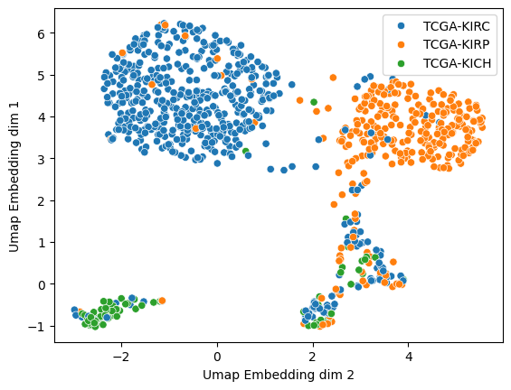

## Problem statement

Given ~1500 samples total of 3 sub-types of Kidney cancer and 60660 gene expression features (Normalized fragments per kilo million[fpkm]), how well can we stratify the sub-chorts visually after applying dimensionality reduction methods? 

Questions:

- Is there overall good stratification of the sub-types?

- What is the performance difference of
  
  - Different umap models?
    
    - Different embedding spaces (plane, sphere, hyperbeloid, etc)
    - Different UMAP methods (neural network, sparse method, etc)

-  How does best UMAP model compare to other DR methods (t-SNE, Local linear embedding, etc) in terms of supervised learning performance? 

- How good is the biological interpretability of clusters formed compared to other methods (t-SNE, PCA, spectral clustering, etc)?  

## Methods
#### I. Dimensionality reduction using UMAP:
 - Using standard scaler on fpkm_unstranded values for tightening the range of values. 
 - Using 3 different types of mappers (plane, sphere and hyperbeloid), visualize the reduced dataset for Class Labels TCGA-KICH, TCGA-KIRC, TCGA-KIRP

#### II. Parametric (neural network) Embedding

TO BE EXPLORED

#### III. Dimensionality reduction using t-SNE:

TO BE EXPLORED

#### IV. Dimensionality reduction using PCA:
TO BE EXPLORED
## Visualizations/Results

A. Performance of UMAP as a function of different embedding spaces: 

1. 2D plots for plane and hyperbeloid embedding mappers 
   

   
 

2. 3D plot for sphere mapper 
   
   
   